# W9 Monitoring + Canary

This project extends the morning GitOps lab with a frontend/backend application, observability through Prometheus and Grafana, email alerting through Alertmanager, and progressive delivery using Argo Rollouts.

Main goals:

- continue using the ArgoCD `root` app-of-apps pattern
- deploy `demo-api` and `demo-web`
- scrape application metrics from `demo-api`
- evaluate service health with `PrometheusRule`
- route alert notifications to `nvtvlog234@gmail.com`
- release safely with `Rollout` and `AnalysisTemplate`

## Architecture

Main components:

- ArgoCD `root` application
- `monitoring-config`
- `kube-prometheus-stack`
- `argo-rollouts`
- `demo-api` as a `Rollout`
- `demo-web` as a `Deployment`

Repository map:

- `argocd/apps/`
- `k8s-api/`
- `k8s-monitoring/`
- `k8s-web/`
- `app/api/`
- `app/web/`

Sync order:

- wave `0`: `monitoring-config`, `kube-prometheus-stack`, `argo-rollouts`
- wave `1`: `demo-api`
- wave `2`: `demo-web`

## Application overview

### Frontend

- service: `demo-web`
- responsibilities:
  - call the backend
  - display the current backend version
  - display runtime error-rate information
  - generate traffic through `Call API` and `Burst x20`

### Backend

- service: `demo-api`
- framework: Flask
- endpoints:
  - `/healthz`
  - `/api/config`
  - `/api/info`
  - `/metrics`

## Build images into Minikube

Git Bash:

```bash
cd /d/Gitops_W9
export MINIKUBE_PROFILE=minikube
./build-minikube-images.sh
```

For a newer backend release:

```bash
export API_IMAGE=w9-demo-api:2
./build-minikube-images.sh
```

## Quick verification

### Open the frontend inside the cluster

```powershell
kubectl -n demo port-forward svc/demo-web 8081:80
```

Open:

- `http://localhost:8081`

### Open Prometheus

```powershell
kubectl -n monitoring port-forward svc/kube-prometheus-stack-prometheus 9090:9090
```

Open:

- `http://localhost:9090`

### Open Alertmanager

```powershell
kubectl -n monitoring port-forward svc/kube-prometheus-stack-alertmanager 9093:9093
```

Open:

- `http://localhost:9093`

### Prometheus queries

Request count:

```promql
flask_http_request_total{namespace="demo",service="demo-api"}
```

Request rate:

```promql
sum(rate(flask_http_request_total{namespace="demo",service="demo-api"}[1m]))
```

Error rate:

```promql
sum(rate(flask_http_request_total{namespace="demo",service="demo-api",status=~"5.."}[1m]))
/
clamp_min(sum(rate(flask_http_request_total{namespace="demo",service="demo-api"}[1m])), 0.001)
```

## SLO, alerting, and canary

### SLO and alerting

Files:

- `k8s-api/prometheus-rule.yaml`
- `k8s-monitoring/alertmanager-email-secret.yaml`

Target:

- availability SLO: `99%`
- error budget: `1%`

Implemented alerts:

- `DemoApiHighErrorRateFastBurn`
- `DemoApiHighErrorRateSlowBurn`

Alert receiver:

- `nvtvlog234@gmail.com`

### Canary

Files:

- `k8s-api/rollout.yaml`
- `k8s-api/analysis-template.yaml`

Rollout flow:

1. `25%`
2. pause for `60s`
3. `50%`
4. pause for `60s`
5. `100%`

The `AnalysisTemplate` evaluates Prometheus metrics to decide whether the release is safe to continue.

## Evidence

### 1. ArgoCD overview

All new components are managed through GitOps.

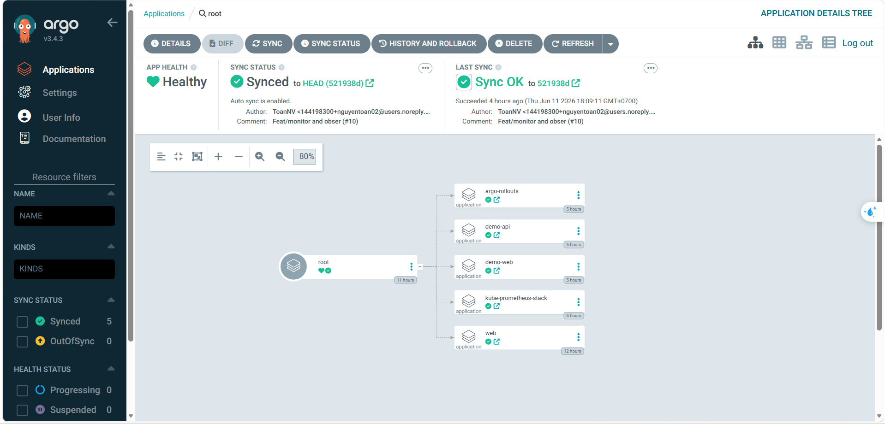

### 2. Frontend running inside the cluster

The frontend can successfully call the backend and display runtime information.

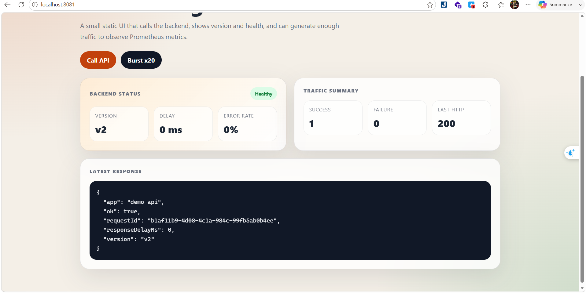

### 3. Metrics in Prometheus

Prometheus is scraping `demo-api` successfully.

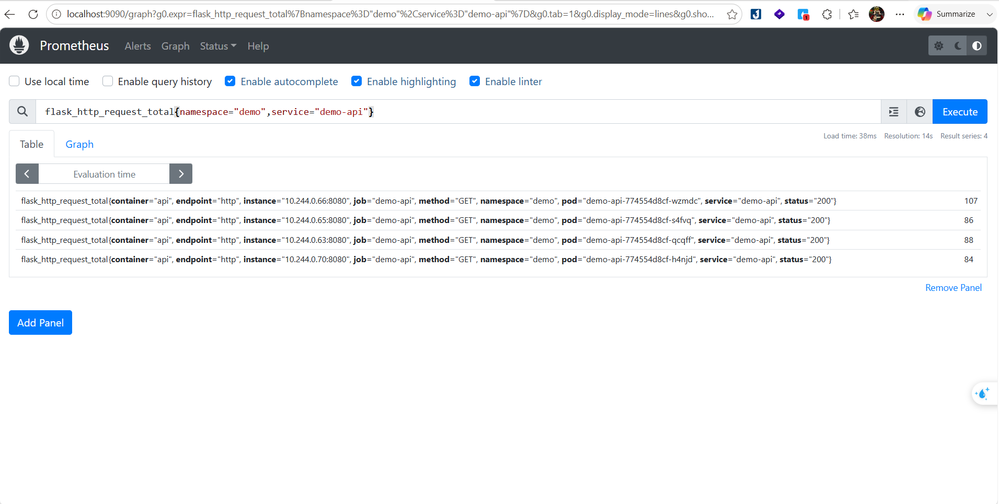

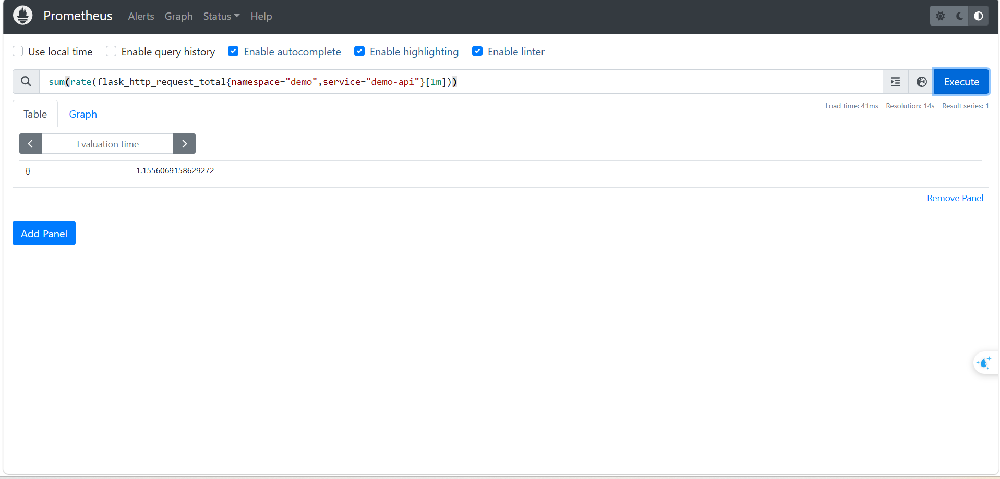

### 4. Good release / canary

Canary rollout is executed through `Rollout` and `AnalysisRun`.

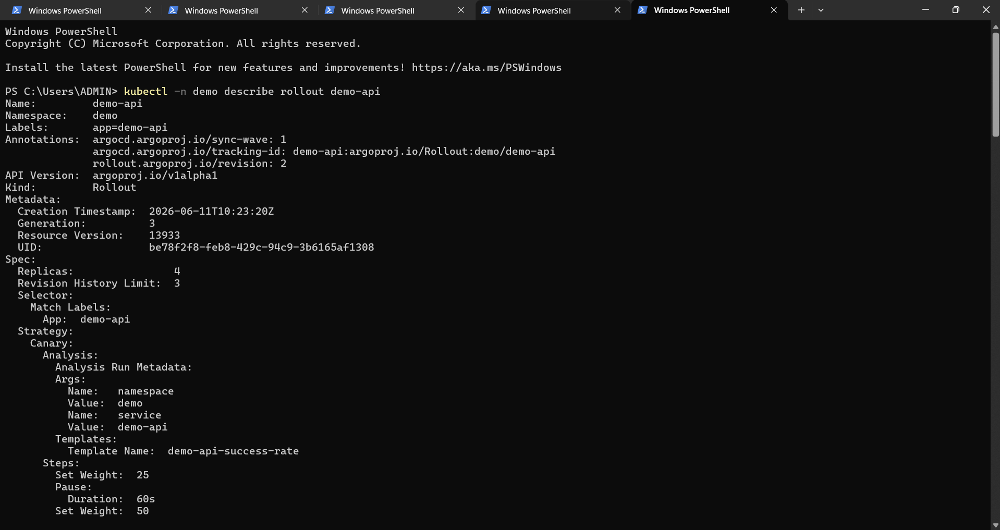

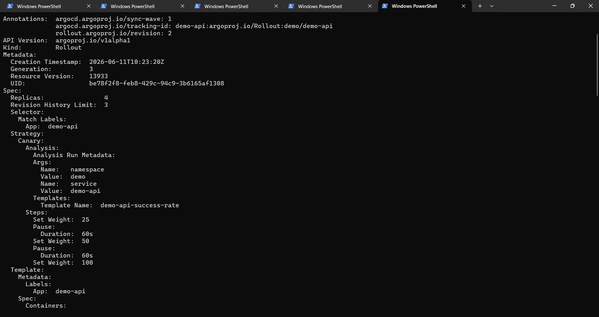

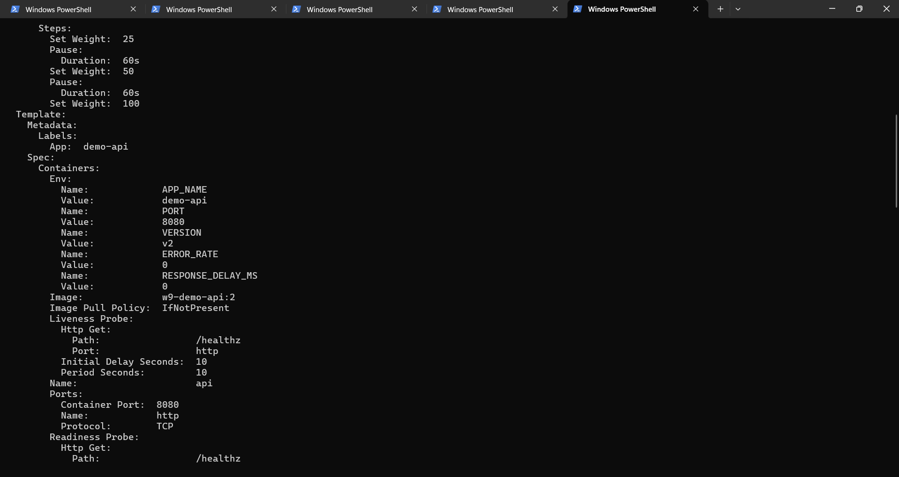

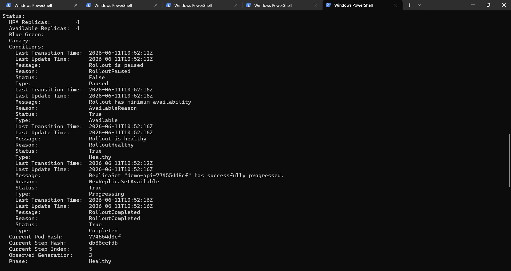

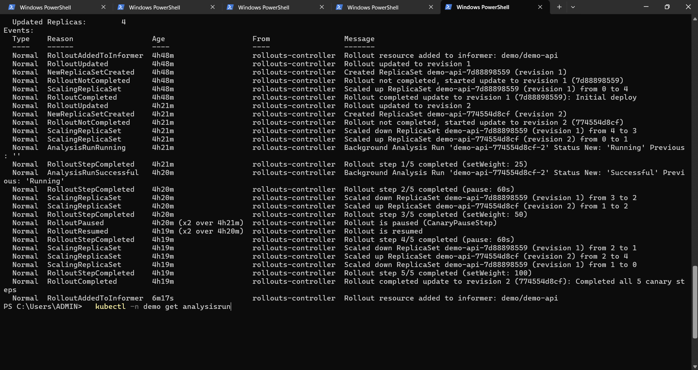

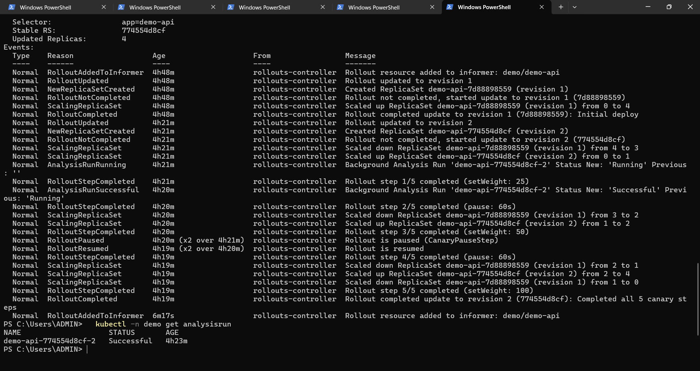

### 5. Alert delivery

Alertmanager is able to route notifications to the configured personal email inbox.

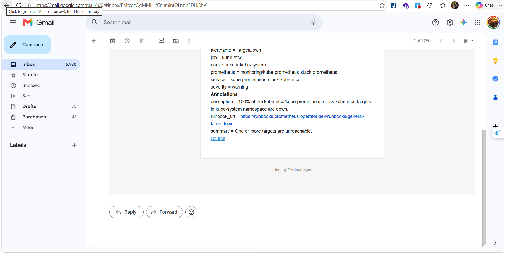

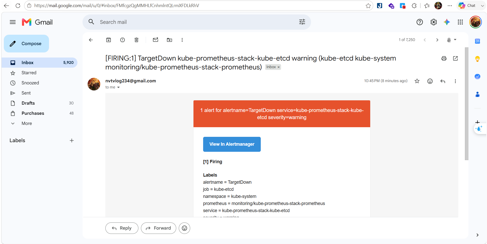

### 6. Rollout abort evidence

The bad canary release is blocked and the stable ReplicaSet is kept in place.

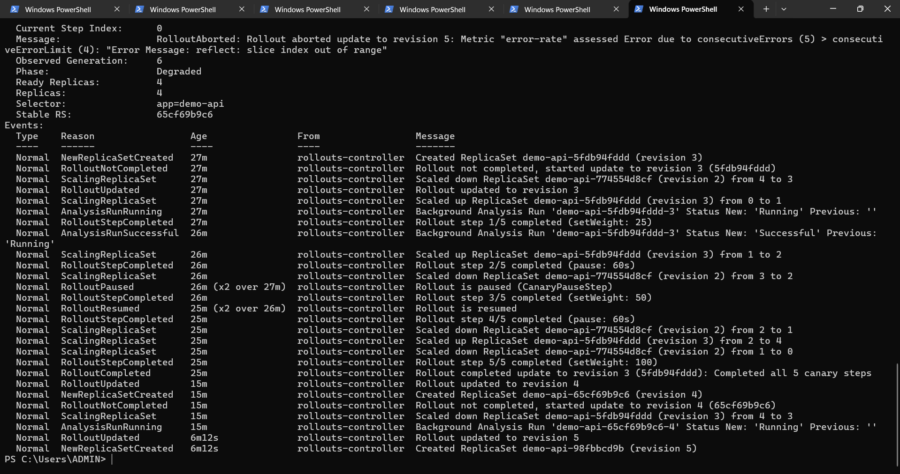

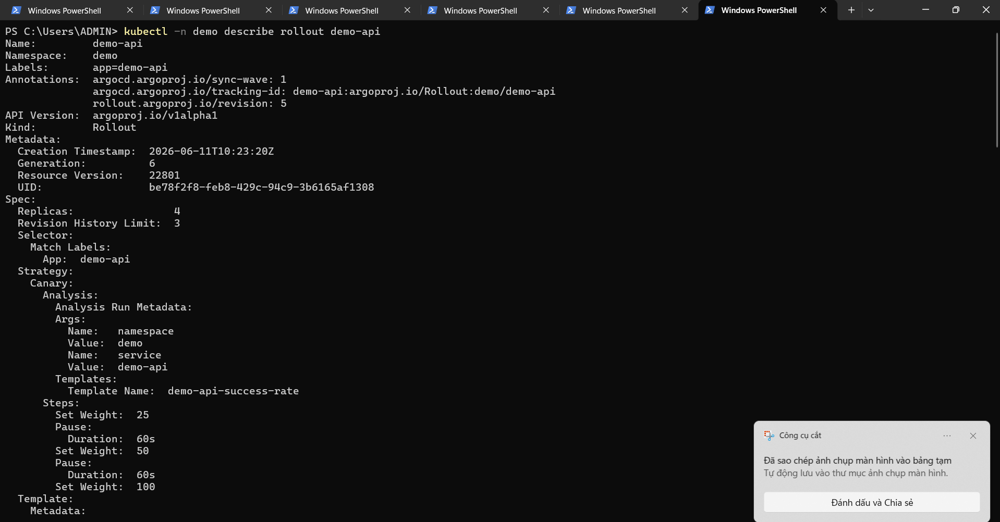

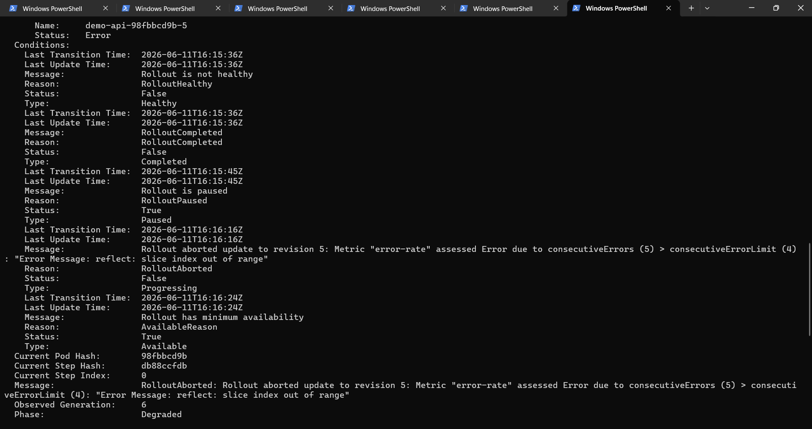

### 7. Alerts and analysis

Metrics and alerting provide the evaluation signal for release quality.

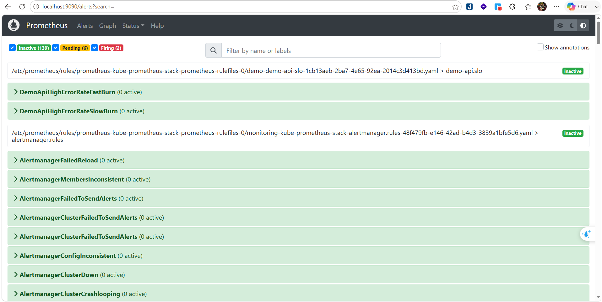

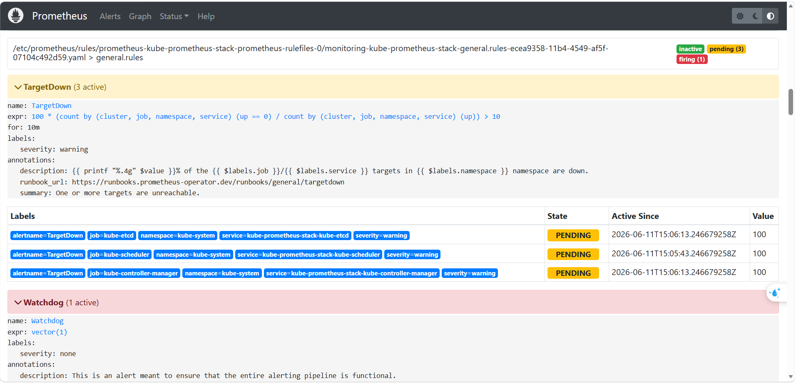

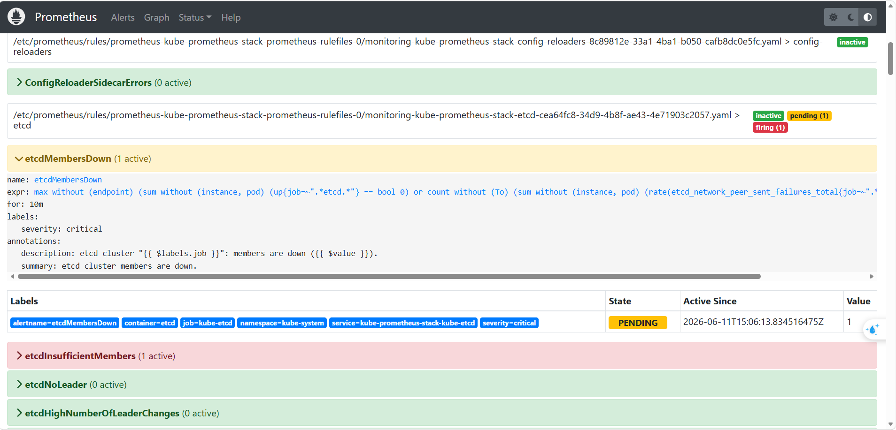

### 8. Release state

Release snapshot from the deployment flow.

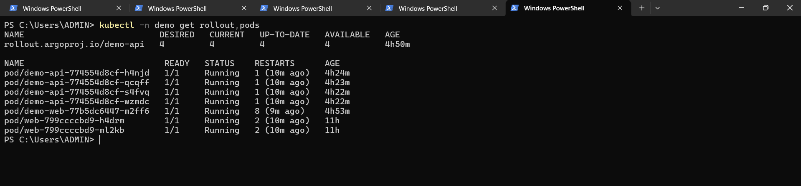

## Demo script

Suggested presentation flow:

1. open ArgoCD and show `root`, `monitoring-config`, `kube-prometheus-stack`, `argo-rollouts`, `demo-api`, and `demo-web`
2. open `demo-web`, click `Call API`, then `Burst x20`
3. open Prometheus and show `demo-api` metrics
4. show `PrometheusRule` and the Alertmanager receiver
5. show the canary rollout for the good `v2` release
6. show the bad release abort evidence for `v5-bad`
7. show the alert email received in the inbox
8. show Git-based rollback using `git revert`

## Rollback

Rollback stays Git-first:

```bash
git revert <commit>
git push
```

This preserves Git as the single source of truth.

## Current status

The project currently includes:

- frontend and backend running inside Kubernetes
- `ServiceMonitor`
- `PrometheusRule`
- Alertmanager email configuration
- `Rollout`
- `AnalysisTemplate`
- Prometheus metrics
- a verified good canary release flow
- alert email delivery evidence
- rollout abort evidence for a bad canary release
